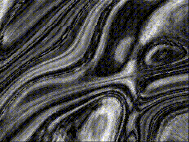

# Old code saved for posterity

These are listings from programs I wrote that were published in Acorn User magazine 1996-1998. These are mostly experiments in computer graphics, written in a combination of BBC BASIC V and ARM assembly language.

  

*Output of `arm_bg,fd1` and `warp.s` on a StrongARM RiscPC*
